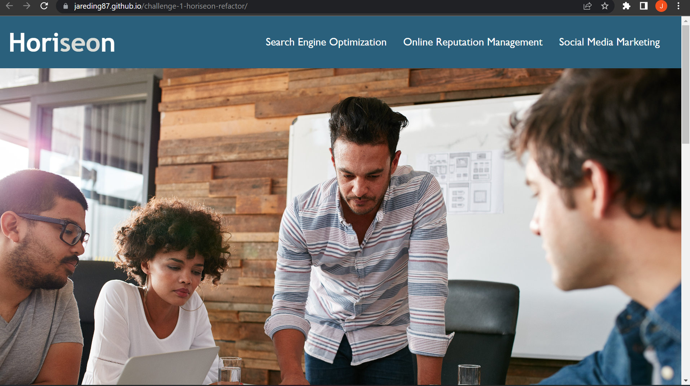

# personal-portfolio

#In this project I created a personal portfolio to display my coding and web design projects. Webpage includes a head and nav bar, which will direct you to one of three catagories. The first category is 'About Me', which includes a photo and and brief description of myself. The second category is 'Works', which includes links to completed projects. the final category is 'Contact Me', which provides various was to contact me directly. The page finishes with a footer at the bottom of the page.

https://jareding87.github.io/personal-portfolio/
v
